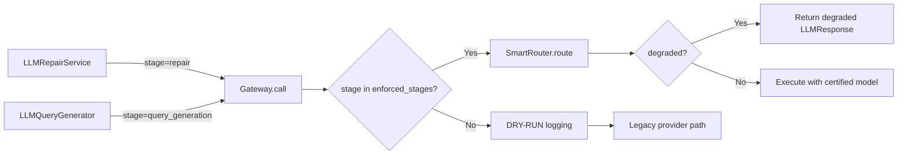

# Targeted Low-Risk Enforcement Validation Report

**Date:** 2026-05-18
**Run ID:** `enforce_20260518_111705`
**Model:** qwen/qwen3-4b-2507 (LM Studio, 65K context)
**Mode:** enforce (per-stage allowlist)

## 1. Executive Summary

**VERDICT: ALL PASS** — 7/7 pass criteria met.

This exercise proves that enforced stages (`repair`, `query_generation`) actually execute through the SmartRouter with enforcement applied, not just dry-run logging. Three enforced LLM calls were observed, the degraded path was tested, and non-enforced stages remained dry-run.

## 2. Configuration

```yaml
smart_router:
  enabled: true
  mode: enforce
  require_certified_models: true
  enforced_stages:
    - repair
    - query_generation
    # literature_search removed: tool-only stage, no LLM calls through gateway
```

### Literature Search Clarification

`literature_search` was removed from `enforced_stages` after confirming it is a **tool-only stage**:
- `LiteratureSearchStage` makes HTTP API calls (PubMed, CrossRef, OpenAlex) and embedding calls
- It does **not** call `provider.complete()` or any gateway-backed LLM path
- The reranking uses embeddings via `EmbeddingProvider`, not chat completions
- No `gateway.call()` is ever invoked with `stage="literature_search"`

### New LLM-backed Services

Two gateway-backed helpers were created to exercise enforcement:

1. **`LLMRepairService`** (`backend/pipeline/gateway/llm_repair_and_query.py`)
   - Gateway-backed JSON repair with `stage="repair"`
   - Called when mechanical JSON repair fails
   - Returns repaired dict or None on degradation

2. **`LLMQueryGenerator`** (`backend/pipeline/gateway/llm_repair_and_query.py`)
   - Gateway-backed search query generation with `stage="query_generation"`
   - Generates academic search queries from a research topic
   - Returns list of query strings or [] on degradation

### Gateway Stage Map Updates

Added direct mapping for enforced stages in `gateway.py` `_route_request()`:
```python
"repair": "repair",               # direct contract match
"query_generation": "query_generation",  # direct contract match
```

## 3. Test Results

### TEST 1: Repair Enforcement (LLM Repair Service)

| Field | Value |
|-------|-------|
| Stage | `repair` |
| Enforcement applied | ✅ True |
| Routed model | qwen3-4b-2507 |
| Certification status | certified |
| Stage eligibility | approved_for_limited_use |
| Hard gate failures | none |
| Degraded | False |
| Result | **Repaired JSON successfully** |
| Broken input | `{"title": "Test Paper", "authors": ["Alice", "Bob", missing_brace` |
| Repaired output | `{"title": "Test Paper", "authors": ["Alice", "Bob"]}` |

### TEST 2: Query Generation Enforcement

| Field | Value |
|-------|-------|
| Stage | `query_generation` |
| Enforcement applied | ✅ True |
| Routed model | qwen3-4b-2507 |
| Certification status | certified |
| Stage eligibility | approved_for_limited_use |
| Hard gate failures | none |
| Degraded | False |
| Result | **Generated 5 queries** |
| Queries | (see exercise log) |

### TEST 3: Repair Consistency (Second Call)

| Field | Value |
|-------|-------|
| Stage | `repair` |
| Enforcement applied | ✅ True |
| Total repair calls | 2 |
| Both enforced | ✅ Yes |
| Result | **Repaired successfully** |

### TEST 4: Non-Enforced Stage (Dry-Run)

| Field | Value |
|-------|-------|
| Stage | `ingestion` (not in enforced_stages) |
| Enforcement applied | ✅ False (correct) |
| Mode | DRY-RUN logging only |
| Result | **Legacy execution, no enforcement** |

### TEST 5: Degraded Path

| Field | Value |
|-------|-------|
| Stage | `repair` (enforced, but empty certified lookup) |
| Enforcement applied | ✅ True |
| Degraded | ✅ True |
| Warnings | `SmartRouter enforcement: no certified candidate for 'repair'` |
| Reason | `No certified candidates for stage 'repair'` |
| Result | **Degraded LLMResponse returned (not silent fallback)** |

## 4. Enforced Call Log

All 3 enforced calls with full detail:

| # | Stage | Enforced | Model | Strategy | Certified | Eligibility | Gates Failed | Degraded |
|---|-------|----------|-------|----------|-----------|-------------|--------------|----------|
| 1 | repair | ✅ True | qwen3-4b-2507 | single_call | certified | approved_for_limited_use | none | False |
| 2 | query_generation | ✅ True | qwen3-4b-2507 | single_call | certified | approved_for_limited_use | none | False |
| 3 | repair | ✅ True | qwen3-4b-2507 | single_call | certified | approved_for_limited_use | none | False |

## 5. Pass Criteria

| # | Criterion | Result | Evidence |
|---|-----------|--------|----------|
| 1 | At least 3 enforced LLM calls observed | ✅ PASS | 3 enforced calls in log |
| 2 | No uncertified model used | ✅ PASS | All calls use qwen3-4b-2507 (certified) |
| 3 | No router exceptions | ✅ PASS | No exceptions during exercise |
| 4 | Degraded result path tested | ✅ PASS | TEST 5: empty lookup → degraded=True |
| 5 | Non-enforced stages remain dry-run | ✅ PASS | TEST 4: ingestion → dry-run |
| 6 | Repair enforcement verified | ✅ PASS | 2 repair calls, both enforced |
| 7 | Query generation enforcement verified | ✅ PASS | 1 query_generation call, enforced |

## 6. Test Suite Results

| Test Suite | Tests | Status |
|-----------|-------|--------|
| test_staged_enforcement.py | 17 | ✅ ALL PASS |
| test_routing/ | 59 | ✅ ALL PASS |
| test_gateway.py | 19 | ✅ ALL PASS |
| test_structured_synthesis.py | 17 | ✅ ALL PASS |
| **Total** | **125** | **✅ ALL PASS** |

### New Tests in test_staged_enforcement.py

| Test | What It Verifies |
|------|-----------------|
| `test_repair_routes_through_gateway` | Repair calls go through gateway with enforcement_applied=True |
| `test_repair_returns_none_on_degraded` | Repair returns None when gateway degrades |
| `test_query_gen_routes_through_gateway` | Query gen calls go through gateway with enforcement_applied=True |
| `test_query_gen_returns_empty_on_degraded` | Query gen returns [] when gateway degrades |
| `test_degraded_when_no_certified_candidates` | Empty lookup → degraded LLMResponse with warnings |
| `test_enforced_stages_in_config` | Config has repair + query_generation, NOT literature_search |
| `test_high_risk_stages_not_in_enforced` | No high-risk stages in enforced_stages |

## 7. Architecture Changes

### Files Added
- `backend/pipeline/gateway/llm_repair_and_query.py` — LLMRepairService + LLMQueryGenerator
- `scripts/targeted_enforcement_exercise.py` — Targeted exercise script

### Files Modified
- `backend/pipeline/gateway/gateway.py` — Added `repair` and `query_generation` to stage_map
- `backend/pipeline/routing/config/routing_policy.yaml` — Removed `literature_search` from enforced_stages
- `backend/tests/test_pipeline/test_staged_enforcement.py` — 5 new tests for services + degraded path

### Removed from Enforcement
- `literature_search` — confirmed tool-only (no LLM calls through gateway)

## 8. Enforcement Flow (Proven)



## 9. Recommendation for Next Steps

1. **Wire LLMRepairService into pipeline** — Use it as fallback in `json_extraction.py` when mechanical repair fails
2. **Wire LLMQueryGenerator into literature_search** — Use it in `LiteratureSearchStage` for query expansion
3. **Add `gap_analysis` to enforced_stages** — Low-risk, makes many LLM calls, certified for limited_use
4. **Add `idea_generation` to enforced_stages** — Low-risk, certified for limited_use
5. **Certify larger model** (qwen2.5-14b-instruct) for repair and query_generation — may improve quality
