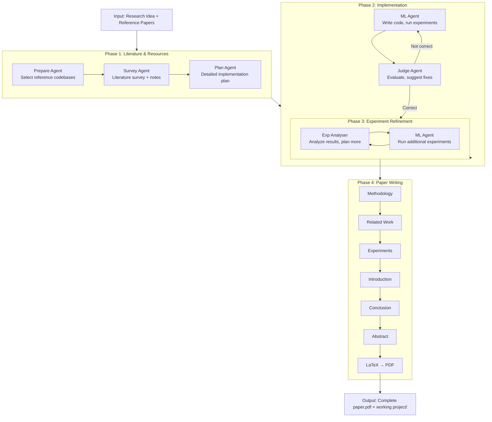
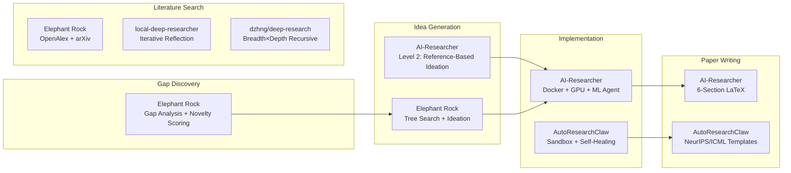

# HKUDS/AI-Researcher — Comprehensive Competitive Study

**Repository**: https://github.com/HKUDS/AI-Researcher  
**Stars**: 5.3K | **Forks**: 660 | **Commits**: 35 | **License**: CC-BY-4.0  
**Paper**: arXiv:2505.18705 — **NeurIPS 2025 Spotlight**  
**Authors**: Jiabin Tang, Lianghao Xia, Zhonghang Li, Chao Huang (HKU Data Science)  
**Date**: 2026-05-06  
**Tech Stack**: Python, Docker, LLM agents (GPT-4o, Gemini 2.5 Pro via OpenRouter), Playwright, LiteLLM  

---

## 1. What It Is

**AI-Researcher** is a fully autonomous research system that takes a research idea (or just reference papers) and produces a complete, publication-ready academic paper with working code, real experiments, and statistical results. It is the **first system to demonstrate human-level-quality paper generation with executable experiments** — and it's been accepted as a **NeurIPS 2025 Spotlight paper**.

**Key claim**: "Produces research papers that approach human-level quality" with "remarkable implementation success rates."

**Tagline**: "Autonomous Scientific Innovation"

---

## 2. Architecture Overview

### 2.1 Source Structure

```
AI-Researcher/
├── main_ai_researcher.py        # Main entry point (3 modes)
├── web_ai_researcher.py          # Gradio Web GUI
├── global_state.py               # Global state management
├── research_agent/               # Core research automation
│   ├── run_infer_plan.py         # Level 1: Detailed Idea → implementation
│   ├── run_infer_idea.py         # Level 2: Reference papers → idea → implementation
│   ├── run_infer_level_1.sh      # Shell wrapper for Level 1
│   ├── run_infer_level_2.sh      # Shell wrapper for Level 2
│   ├── constant.py               # Configuration constants
│   └── inno/                     # Innovation engine (MetaChain framework)
│       ├── workflow/             # FlowModule, ToolModule, AgentModule
│       ├── agents/               # 7 specialized agents
│       │   └── inno_agent/
│       │       ├── plan_agent.py       # Coding plan generation
│       │       ├── prepare_agent.py    # Resource selection
│       │       ├── ml_agent.py         # Code implementation + execution
│       │       ├── judge_agent.py      # Evaluation + suggestions
│       │       ├── survey_agent.py     # Literature survey
│       │       └── exp_analyser.py     # Experiment analysis
│       ├── tools/                # Tool integrations
│       │   ├── inno_tools/
│       │   │   ├── paper_search.py     # arXiv paper search
│       │   │   └── code_search.py      # GitHub repo + code search
│       │   └── arxiv_source.py         # arXiv source download
│       ├── environment/          # Execution environments
│       │   ├── docker_env.py           # Docker container management
│       │   ├── browser_env.py          # Web browsing
│       │   └── markdown_browser.py     # Markdown content browsing
│       └── logger.py             # MetaChain logging
├── paper_agent/                  # Paper writing subsystem
│   ├── writing.py                # Orchestrates 6 section writers + LaTeX compilation
│   ├── methodology_composing_using_template.py
│   ├── related_work_composing_using_template.py
│   ├── experiments_composing.py
│   ├── introduction_composing.py
│   ├── conclusion_composing.py
│   ├── abstract_composing.py
│   ├── section_composer.py       # Generic section composition
│   ├── tex_writer.py             # LaTeX compilation
│   ├── writing_fix.py            # LaTeX cleanup/fixing
│   └── {domain}/writing_templates/  # Per-domain LaTeX templates
│       ├── diffu_flow/
│       ├── gnn/
│       ├── rec/
│       └── vq/
├── benchmark/                    # Scientist-Bench evaluation suite
│   ├── final/                    # Final benchmark instances
│   │   ├── diffu_flow/           # Diffusion & Flow Matching
│   │   ├── gnn/                  # Graph Neural Networks
│   │   ├── reasoning/           # Reasoning
│   │   ├── recommendation/      # Recommendation Systems
│   │   └── vq/                   # Vector Quantization
│   └── process/dataset_candidate/ # Per-category dataset/baseline definitions
├── benchmark_collection/         # Benchmark data collection pipeline
├── docker/                       # Docker image definition
├── examples/                     # 7 complete example outputs
│   ├── rotation_vq/              # Paper + project (full output)
│   ├── fsq/
│   ├── hgcl/
│   ├── dccf/
│   ├── con_flowmatching/
│   ├── gnn_nodeformer/
│   └── gnn_difformer/
└── assets/                       # Images, diagrams
```

### 2.2 Dependencies

```toml
# Key dependencies (via pyproject.toml)
langchain / litellm       # Multi-model LLM access (GPT-4o, Gemini, etc.)
docker                    # Container management
playwright                # Browser automation
gradio                    # Web GUI
pydantic                  # Data models
tqdm                      # Progress bars
```

---

## 3. The Multi-Agent Innovation Engine

### 3.1 Agent Architecture (7 Agents)

AI-Researcher uses a **multi-agent pipeline** built on the **MetaChain** framework:



### 3.2 Agent Roles

| Agent | Model | Purpose | Key Actions |
|-------|-------|---------|-------------|
| **Prepare Agent** | Cheap (Gemini 2.5 Flash) | Select reference repos | Searches GitHub, chooses ≥5 repos |
| **Survey Agent** | Cheap | Literature synthesis | Reads papers + code, produces survey notes |
| **Plan Agent** | Cheap | Implementation planning | Creates detailed coding plan with structure |
| **ML Agent** | Expensive (GPT-4o) | Code generation + execution | Writes code, runs training/testing in Docker |
| **Judge Agent** | Cheap | Evaluation + suggestions | Checks correctness, suggests fixes |
| **Exp Analyser** | Cheap | Result analysis | Analyzes metrics, plans further experiments |

### 3.3 Two-Level Input

**Level 1: Detailed Idea Description**
User provides a comprehensive research idea (like the examples in the README — 6-point descriptions with methodology, implementation details, step-by-step integration). The system implements it directly.

**Level 2: Reference-Based Ideation**
User provides only reference papers. The system generates novel ideas from them, then implements.

---

## 4. The Implementation Flow in Detail

### 4.1 Phase 1: Literature & Resources

```python
# From run_infer_plan.py

# 1. Load benchmark instance (papers + task instructions)
metadata = load_instance(instance_path, task_level)

# 2. Search GitHub for reference codebases
github_result = github_search(metadata)

# 3. Prepare Agent selects ≥5 repos
prepare_messages = await prepare_agent(messages, context_variables)

# 4. Download arXiv paper sources (LaTeX)
download_res = download_arxiv_source_by_title(paper_list)

# 5. Survey Agent creates comprehensive model survey notes
survey_messages = await survey_agent(messages, context_variables)

# 6. Plan Agent creates detailed implementation plan
plan_messages = await plan_agent(messages, context_variables)
```

### 4.2 Phase 2: Implementation (The ML Agent Loop)

The ML Agent is given extremely detailed instructions:

```python
# From the ml_dev_query in run_infer_plan.py (verbatim):

"""
PROJECT STRUCTURE REQUIREMENTS:
1. Directory Organization
- Data: /{workplace_name}/project/data/
     * Use the dataset selected by the Plan Agent
     * NO toy or random datasets
- Model Components: /{workplace_name}/project/model/
    * All model architecture files
    * All model components as specified in survey notes
    * Dataset processing scripts and utilities
- Training: /{workplace_name}/project/training/
    * Training loop implementation
    * Loss functions
    * Optimization logic
- Testing: /{workplace_name}/project/testing/
    * Evaluation metrics
    * Testing procedures
- Data processing: /{workplace_name}/project/data_processing/
    * Implement the data processing pipeline
- Main Script: /{workplace_name}/project/run_training_testing.py
    * Complete training and testing pipeline
    * Configuration management
    * Results logging

2. Complete Implementation Requirements
   - MUST implement EVERY component from model survey notes
   - NO placeholder code (no pass, ..., raise NotImplementedError)
   - MUST include complete logic and mathematical operations
   - Each component MUST be fully functional and tested

3. Dataset and Training Requirements
   - Select and download ONE actual dataset from references
   - Implement full data processing pipeline
   - Train for exactly 2 epochs
   - Test model performance after training
   - Log all metrics and results
"""
```

After initial implementation, the Judge evaluates and the ML Agent iterates:

```python
# Judge-ML iteration loop
for i in range(MAX_ITER_TIMES):
    # ML Agent modifies based on Judge feedback
    judge_messages, context_variables = await ml_agent(judge_messages, context_variables)
    # Judge evaluates again
    judge_messages, context_variables = await judge_agent(judge_messages, context_variables)
    # Break if fully correct
    if '"fully_correct": true' in judge_messages[-1]["content"]:
        break
```

### 4.3 Phase 3: Experiment Refinement

```python
# Run additional experiments (ablation, sensitivity, visualization)
EXP_ITER_TIMES = 2
for i in range(EXP_ITER_TIMES):
    # Exp Analyser analyzes results and plans further experiments
    judge_messages, context_variables = await exp_analyser(judge_messages, context_variables)
    analysis_report = context_variables["experiment_report"][-1]["analysis_report"]
    further_plan = context_variables["experiment_report"][-1]["further_plan"]
    
    # ML Agent executes the further experiments
    judge_messages, context_variables = await ml_agent(judge_messages, context_variables)
```

### 4.4 Phase 4: Paper Writing

```python
# From paper_agent/writing.py

async def writing(research_field, instance_id):
    await methodology_composing(research_field, instance_id)
    await related_work_composing(research_field, instance_id)
    await experiments_composing(research_field, instance_id)
    await introduction_composing(research_field, instance_id)
    await conclusion_composing(research_field, instance_id)
    await abstract_composing(research_field, instance_id)
    
    clean_tex_files_in_folder(target_folder)
    compile_latex_project(project_directory, main_file)
```

Each section composer uses LLM + templates to generate LaTeX. Templates are **domain-specific** (gnn/, rec/, vq/, diffu_flow/).

---

## 5. Scientist-Bench: The Benchmark

### 5.1 Benchmark Structure

| Category | Focus | Examples |
|----------|-------|---------|
| **Vector Quantization** | VQ-VAE, FSQ, discrete representations | Rotation VQ, one-layer VQ |
| **GNN** | Graph neural networks, node classification | NodeFormer, Difformer |
| **Recommendation** | Collaborative filtering, graph-based rec | HGCL, DCCF |
| **Diffusion & Flow** | Generative models, normalizing flows | Consistency flow matching |
| **Reasoning** | LLM reasoning | (Not detailed in README) |

### 5.2 Task Levels

**Task 1 (Level 1)**: Given a detailed idea description + reference papers → implement  
**Task 2 (Level 2)**: Given only reference papers → generate idea + implement  

### 5.3 Evaluation Metrics

- **Implementation success rate**: Does the code run?
- **Paper quality**: How close to human-level quality?
- **Experimental correctness**: Do results make sense?

---

## 6. Docker-Based Execution Environment

All code execution happens inside Docker containers:

```yaml
# Environment setup
docker pull tjbtech1/airesearcher:v1

# Configuration
DOCKER_WORKPLACE_NAME=workplace_paper
BASE_IMAGES=tjbtech1/airesearcher:v1
GPUS='"device=0"'       # GPU allocation
PORT=7020                # Communication port
PLATFORM=linux/amd64
```

Key features:
- **GPU support**: NVIDIA CUDA devices mapped into container
- **Dataset pre-loading**: `setup_dataset(category, code_env.local_workplace)` copies benchmark datasets
- **File browser**: `RequestsMarkdownBrowser` for reading downloaded papers
- **Web browser**: `BrowserEnv` for web searches
- **Port communication**: Container ↔ host via configured port

---

## 7. LLM Configuration

Uses **LiteLLM** for model-agnostic access:

```env
# Completion model (expensive, for code generation)
COMPLETION_MODEL=openrouter/google/gemini-2.5-pro-preview-05-20

# Cheap model (for planning, evaluation, survey)
CHEEP_MODEL=openrouter/google/gemini-2.5-pro-preview-05-20

# API keys
OPENROUTER_API_KEY=your_key
GITHUB_AI_TOKEN=your_token
```

The system uses **two tiers of models**:
- **Expensive model** (GPT-4o): ML Agent (code generation)
- **Cheap model** (Gemini 2.5 Flash): All other agents (planning, evaluation, survey)

---

## 8. Showcase Results — 7 Examples

The README shows **7 complete examples** across all 5 domains. Each produces:
1. **Full paper.pdf** — Conference-formatted (ICLR 2025 template)
2. **Complete project/** — Runnable code with training/testing

### Example Outputs

| Example | Domain | Output |
|---------|--------|--------|
| Rotation VQ | Vector Quantization | Paper + working VQ-VAE with rotation-based gradient fix |
| FSQ | Vector Quantization | Paper + finite scalar quantization implementation |
| HGCL | Recommendation | Paper + heterogeneous GNN + contrastive learning |
| DCCF | Recommendation | Paper + disentangled contrastive CF |
| Consistency Flow Matching | Diffusion | Paper + CNF with velocity consistency loss |
| NodeFormer | GNN | Paper + kernelized Gumbel-Softmax for node classification |
| Difformer | GNN | Paper + energy-constrained diffusion Transformer |

---

## 9. Comprehensive Comparison Matrix

### 9.1 vs AutoResearchClaw

| Aspect | AutoResearchClaw | AI-Researcher |
|--------|-----------------|---------------|
| **Stars** | 11.9K | 5.3K |
| **Paper accepted** | ❌ No | ✅ NeurIPS 2025 Spotlight |
| **Experiment execution** | Sandbox (subprocess) | Docker container with GPU |
| **Code generation** | LLM + Claude Code + Codex | LLM (GPT-4o) only |
| **Paper quality** | Good (AI-generated) | "Approaches human-level" |
| **Self-healing** | ✅ Up to 10 iterations | ✅ Judge-ML agent loop |
| **Benchmark** | 8 showcase papers | Scientist-Bench (5 domains) |
| **Domain breadth** | 8 domains | 5 AI domains |
| **Literature search** | OpenAlex + S2 + arXiv | arXiv + GitHub |
| **Citation verification** | 4-layer | Basic (arXiv source download) |
| **HITL** | 6 modes | None (fully autonomous) |
| **Self-learning** | MetaClaw | None |
| **Frontend** | CLI + Dashboard | Gradio Web GUI |

### 9.2 vs Elephant Rock

| Feature | Elephant Rock | AI-Researcher |
|---------|:---:|:---:|
| **End-to-end papers** | ❌ (proposals only) | ✅ (full papers + code + experiments) |
| **Gap analysis** | ✅ Full pipeline | ❌ (assumes user provides idea) |
| **Novelty scoring** | ✅ 768-dim embeddings | ❌ |
| **Experiment execution** | ❌ | ✅ Docker + GPU |
| **Code generation** | ❌ | ✅ Full project generation |
| **Paper writing** | ❌ | ✅ 6-section LaTeX |
| **Academic APIs** | OpenAlex + arXiv | arXiv + GitHub |
| **Benchmark** | Custom runs | Scientist-Bench |
| **Peer review** | ❌ | ✅ Judge Agent |
| **Runtime** | 10-26 min (partial) | Hours (complete) |
| **Academic validation** | ❌ | ✅ NeurIPS 2025 Spotlight |
| **Feasibility scoring** | ✅ | ❌ |
| **Knowledge graph** | ✅ | ❌ |
| **Tree search** | ✅ | ❌ |
| **Iterative refinement** | ❌ | ✅ Judge-ML loop |

### 9.3 vs local-deep-researcher

| Feature | local-deep-researcher | AI-Researcher |
|---------|:---:|:---:|
| **Output** | Markdown summary | Full paper + code + experiments |
| **Code execution** | ❌ | ✅ Docker + GPU |
| **100% local** | ✅ | ❌ (needs cloud LLM) |
| **Complexity** | ~500 LOC | ~5K+ LOC |
| **Academic validation** | ❌ | ✅ NeurIPS 2025 Spotlight |

### 9.4 vs dzhng/deep-research

| Feature | dzhng/deep-research | AI-Researcher |
|---------|:---:|:---:|
| **Output** | Research report (markdown) | Full paper + code + experiments |
| **Search algorithm** | Recursive breadth×depth | Flat (GitHub + arXiv) |
| **Code execution** | ❌ | ✅ Docker + GPU |
| **Complexity** | ~500 LOC | ~5K+ LOC |
| **Paper writing** | ❌ | ✅ LaTeX |
| **Academic validation** | ❌ | ✅ NeurIPS 2025 Spotlight |

### 9.5 vs u14app/deep-research

| Feature | u14app/deep-research | AI-Researcher |
|---------|:---:|:---:|
| **Output** | Consumer report | Full academic paper |
| **LLM providers** | 14 | 1 (via OpenRouter) |
| **Search engines** | 6 | 1 (arXiv + GitHub) |
| **Code execution** | ❌ | ✅ Docker + GPU |
| **MCP server** | ✅ | ❌ |
| **Paper writing** | ❌ | ✅ LaTeX |
| **Academic validation** | ❌ | ✅ NeurIPS 2025 Spotlight |

---

## 10. Key Architectural Innovations

### 10.1 The Judge-ML Agent Loop

The most significant innovation is the **Judge-ML iterative refinement loop**:

```
ML Agent writes code → Judge Agent evaluates → ML Agent fixes → Judge evaluates again
```

This loop continues until the Judge declares `"fully_correct": true` or `MAX_ITER_TIMES` is exhausted. This is fundamentally different from AutoResearchClaw's approach — it's a **collaborative debate between two agents** rather than a single self-healing pass.

**Key insight**: Two specialized agents (one writing, one evaluating) outperform one agent trying to do both. The ML Agent focuses on generation, the Judge Agent focuses on verification. This is similar to GAN training — generator vs discriminator.

### 10.2 Reference Codebase Selection

The Prepare Agent doesn't just find papers — it finds **actual GitHub repositories** with working code:

```python
github_result += search_github_repos(metadata, source_paper["reference"], 10)
```

The system then downloads these repos and uses them as **implementation references**, producing code that builds on existing work rather than generating from scratch.

**Why this matters**: Most code generation fails because it starts from nothing. By grounding implementation in existing repos, the system dramatically improves success rates.

### 10.3 Domain-Specific Templates

Paper writing uses **per-domain LaTeX templates** (gnn/, rec/, vq/, diffu_flow/), ensuring the output matches the conventions of each research community.

### 10.4 Experiment Refinement Loop

After initial implementation, the Exp Analyser plans additional experiments:
- Ablation studies
- Sensitivity analysis
- Visualization
- Comparison with baselines

This runs 2 additional iterations, producing much richer experimental sections.

### 10.5 Prompt Engineering Excellence

The prompts in `run_infer_plan.py` are **extraordinarily detailed** — each is 500+ words with:
- Explicit directory structure requirements
- Complete implementation checklist
- Anti-pattern prohibitions ("NO placeholder code")
- Verification criteria
- Error handling instructions

This level of prompt engineering is what separates a working system from a prototype.

---

## 11. Critical Assessment

### 11.1 Strengths

1. **NeurIPS 2025 Spotlight**: Academic validation that no other system has achieved
2. **Complete lifecycle**: Idea → code → experiments → paper. The only system that does ALL of this end-to-end
3. **Judge-ML loop**: Dual-agent refinement produces higher quality code than single-agent approaches
4. **Docker + GPU**: Real experiment execution in isolated containers with GPU support
5. **Scientist-Bench**: First standardized benchmark for autonomous research systems
6. **Reference codebases**: Builds on existing work rather than generating from scratch
7. **Domain templates**: Per-domain LaTeX templates ensure publication-quality output
8. **Gradio GUI**: User-friendly interface (compared to CLI-only alternatives)
9. **7 showcase examples**: Complete papers + projects demonstrating the system works
10. **Two-tier LLM**: Cost optimization using expensive model only for code generation

### 11.2 Limitations

1. **Cloud-dependent**: Requires GPT-4o or Gemini. No local model support.
2. **AI/ML only**: 5 domains, all within machine learning. No physics, biology, math, etc.
3. **No gap identification**: User must provide the idea or reference papers. The system doesn't discover research gaps autonomously.
4. **No novelty scoring**: No mechanism to evaluate whether an idea is actually novel.
5. **No citation verification**: Unlike AutoResearchClaw's 4-layer pipeline.
6. **35 commits**: Relatively young project, rapid initial development.
7. **No test suite visible**: No test files in the repository.
8. **Heavy Docker dependency**: Requires Docker + GPU for execution.
9. **No HITL**: Fully autonomous with no human-in-the-loop options.
10. **Expensive**: GPT-4o for code generation, Gemini for planning = significant API costs.
11. **No knowledge graph**: Unlike Elephant Rock, there's no structured knowledge representation.
12. **No tree search**: Unlike Elephant Rock, ideas are not explored via tree search.
13. **No iterative reflection on literature**: Unlike local-deep-researcher, there's no search→reflect→search loop.

### 11.3 The "NeurIPS Spotlight" Factor

This is the **first autonomous research system accepted at a major AI conference**. This is a significant milestone that validates the entire field. However, it's important to note:
- The benchmark is self-created (Scientist-Bench)
- The evaluation criteria focus on implementation success, not novelty
- The system works within well-defined ML domains with known baselines
- The "human-level quality" claim is relative to the specific benchmark, not general academic standards

---

## 12. What Elephant Rock Can Learn

### 12.1 Must Adopt (High Priority)

1. **Docker-based code execution**: The biggest gap between Elephant Rock and AI-Researcher is that AI-Researcher actually RUNS code. Elephant Rock produces proposals but never executes them.

2. **Judge-ML loop**: The dual-agent pattern (one writes, one evaluates) is clearly superior to single-agent approaches. Implement a Judge Agent that evaluates proposals against criteria and iterates.

3. **Reference codebase grounding**: Instead of generating from scratch, find and download existing GitHub repos as implementation starting points.

4. **LaTeX paper writing**: Domain-specific templates + LLM section composition produces publication-ready output.

### 12.2 Should Adopt (Medium Priority)

5. **Experiment refinement loop**: After initial implementation, run additional experiments (ablation, sensitivity) to produce richer results.

6. **Thinking/Task model split**: Use expensive reasoning model for code generation, cheap model for everything else.

7. **Scientist-Bench-style evaluation**: Create a standardized benchmark for evaluating research proposal quality.

### 12.3 Could Adopt (Low Priority)

8. **Gradio GUI**: Alternative to the current React frontend for rapid prototyping.

9. **GitHub code search**: Add code search (not just paper search) to find implementation references.

10. **arXiv LaTeX source download**: Download paper sources to extract mathematical notation and formatting conventions.

---

## 13. Assessment & Rating

| Dimension | Score | Notes |
|-----------|-------|-------|
| **Completeness** | 9.5/10 | Only system that does full idea→paper lifecycle |
| **Code Quality** | 7/10 | Good architecture, but no tests |
| **Innovation** | 9/10 | Judge-ML loop, reference codebases, Scientist-Bench |
| **Practicality** | 7/10 | Docker + GPU requirement limits accessibility |
| **Documentation** | 8/10 | Good README, 7 examples, but code comments are sparse |
| **Academic Rigor** | 9/10 | NeurIPS Spotlight, standardized benchmark |
| **Scalability** | 6/10 | Cloud-only, expensive, Docker-heavy |
| **Extensibility** | 7/10 | Per-domain templates make adding domains easy |
| **Community** | 6/10 | 5.3K stars, 660 forks, but young project |

**Overall: 8.2/10** — The gold standard for autonomous research systems. The NeurIPS Spotlight acceptance validates the approach. The Judge-ML loop is the key architectural innovation. The biggest limitation is the lack of gap identification and novelty scoring — areas where Elephant Rock is stronger.

---

## 14. Competitive Position Summary



**The clear opportunity**: Combine Elephant Rock's gap discovery + novelty scoring with AI-Researcher's code execution + paper writing. This would create the first truly complete autonomous research system — from gap identification through to published paper.

---

## 15. Key Takeaways

1. **AI-Researcher is the most complete autonomous research system** — it's the only one that goes from idea to published paper with working code and real experiments.

2. **The NeurIPS Spotlight acceptance is a game-changer** — it validates that autonomous research is a legitimate academic pursuit, not just a hackathon project.

3. **The Judge-ML loop is the key innovation** — dual-agent collaboration (writer + evaluator) outperforms single-agent approaches.

4. **Elephant Rock and AI-Researcher are complementary** — Elephant Rock excels at the beginning (gap discovery, novelty scoring) while AI-Researcher excels at the end (implementation, experiments, paper writing). A combined system would be dominant.

5. **The gap is execution** — Every competitive tool can search literature and generate text. The differentiator is whether you can actually run experiments and produce real results.

6. **Prompt engineering matters enormously** — AI-Researcher's 500+ word prompts with explicit checklists and anti-patterns are a major factor in its success.

7. **Docker + GPU is non-negotiable for real research** — If you can't execute code with GPU access, you're not doing autonomous research, you're doing literature summarization.

---

## APPENDIX A: Level 2 — Reference-Based Ideation (Deep Code Analysis)

### A.1 The Idea Generation Loop

In Level 2 mode, AI-Researcher generates **5 candidate ideas** and selects the best one:

```python
# From run_infer_idea.py
IDEA_NUM = 5
ideas = [survey_res]  # First idea

# Generate 4 more ideas
for i in range(IDEA_NUM - 1):
    messages.append({"role": "user", "content": "please survey again and give me another idea"})
    survey_messages, context_variables = await self.idea_agent(messages, context_variables, iter_times=i+1)
    ideas.append(survey_messages[-1]["content"])

# Select the best idea
messages = [{"role": "user", "content": f"""
You have generated {IDEA_NUM} innovative ideas.
Your task is to analyze multiple existing ideas, select the most novel one,
enhance the idea if any key information is missing, finally give me the most
novel idea with refined math formula and code implementation.
"""}]
survey_messages, context_variables = await self.idea_agent(messages, context_variables, iter_times="select")
```

**Key insight**: Unlike Elephant Rock's tree search which explores idea space systematically, AI-Researcher uses a simpler "generate N, pick best" approach. It lacks novelty scoring, embedding-based comparison, or feasibility evaluation. The LLM simply judges which of 5 ideas is "most novel."

### A.2 The Code Survey Agent

After idea selection, a **Code Survey Agent** maps the idea to actual code:

```python
# From idea_agent.py
code_survey_query = f"""
I have an innovative idea related to machine learning: {survey_res}
Your task is to carefully understand the innovative idea, and thoroughly
review codebases and generate a comprehensive implementation report.
You can NOT stop to review the codebases until you have get all academic
concepts in the innovative idea.
"""
```

This agent navigates downloaded reference codebases in Docker, identifies relevant code for each academic concept, and produces a comprehensive implementation report bridging idea → code.

### A.3 The Survey Agent (Level 1) — Atomic Definition Pipeline

In Level 1, the Survey Agent orchestrates a **3-agent pipeline** for each atomic concept:

```
Survey Agent → (breaks idea into atomic definitions)
    ↓
    Paper Survey Agent → (extracts math formulas from papers)
        ↓
        Code Survey Agent → (finds code implementations)
            ↓
            back to Survey Agent → (takes notes)
                ↓
                (repeat for next atomic definition)
```

```python
# From idea_agent.py

def transfer_to_paper_survey_agent(academic_definition: str, context_variables):
    """Pass a specific academic definition to extract math formula"""
    context_variables["notes"].append({"definition": academic_definition})
    return Result(agent=paper_survey_agent, context_variables=context_variables)

def transfer_to_code_survey_agent(academic_definition, math_formula, reference_papers, context_variables):
    """Pass math formula to find corresponding code implementation"""
    context_variables["notes"][-1]["math_formula"] = math_formula
    context_variables["notes"][-1]["reference_papers"] = reference_papers
    return Result(agent=code_survey_agent, context_variables=context_variables)

def transfer_back_to_survey_agent(academic_definition, code_implementation, reference_codebases, context_variables):
    """Return to Survey Agent with code implementation findings"""
    context_variables["notes"][-1]["code_implementation"] = code_implementation
    context_variables["notes"][-1]["reference_codebases"] = reference_codebases
    return Result(agent=survey_agent, context_variables=context_variables)
```

**This is the most sophisticated part of the system** — it breaks a complex idea into atomic concepts, traces each through paper → formula → code, and produces a comprehensive knowledge base for the ML Agent to implement.

### A.4 The `case_resolved` / `case_not_resolved` Pattern

Every agent has two termination functions:

```python
def case_resolved(task_response):
    """Use only after successfully completing the task."""
    return task_response

def case_not_resolved(failure_reason):
    """Use only after trying multiple times and still failing."""
    return failure_reason
```

The ML Agent uses these to signal completion or failure. The Judge Agent uses `case_resolved` with `fully_correct: bool` and `suggestion: dict` to provide structured feedback.

---

## APPENDIX B: MetaChain Framework (Deep Code Analysis)

### B.1 Core Architecture

MetaChain is AI-Researcher's agent framework, similar to LangChain or CrewAI but simpler:

```python
class Agent:
    name: str
    model: str
    instructions: Union[str, Callable]  # Can be a function of context_variables
    functions: List[Callable]           # Tool functions
    tool_choice: str                    # "auto", "required", or specific
    parallel_tool_calls: bool
```

```python
class Result:
    value: str                  # Text output
    agent: Agent = None         # Transfer to another agent
    context_variables: dict = {}  # Update shared state
```

### B.2 Agent Transfer Mechanism

Agents can transfer control to other agents by returning a `Result` with a different `agent`:

```python
# Judge Agent transfers to Code Review Agent
def transfer_to_code_review_agent(atomic_idea):
    return code_review_agent  # Returns the Agent object directly

# Code Review Agent transfers back
def transfer_to_judge_agent(task_report):
    return judge_agent
```

This creates a **multi-agent handoff chain**: Judge → Code Review → Judge → ML Agent → Judge → ...

### B.3 Context Window Management

MetaChain handles context window overflow gracefully:

```python
async def try_completion_with_truncation(self, agent, history, context_variables, ...):
    try:
        return await self.get_chat_completion_async(...)
    except (ContextWindowExceededError, BadRequestError) as e:
        if "context length" in error_msg.lower():
            # Truncate last message to 10,000 tokens
            last_message['content'] = truncate_message(last_message['content'])
            return await self.get_chat_completion_async(...)  # Retry
        raise e
```

### B.4 Retry Logic

All API calls use aggressive retry:

```python
@retry(
    stop=stop_after_attempt(6),
    wait=wait_exponential(multiplier=2, min=30, max=1200),  # 30s → 60s → 120s → 240s → 480s → 960s
    retry=should_retry_error,  # Retries on connection errors, rate limits, 429s, overloaded
)
async def get_chat_completion_async(self, ...):
```

Maximum retry: 6 attempts with exponential backoff from 30 seconds to 20 minutes.

### B.5 Function Calling Compatibility Layer

MetaChain handles models that don't support function calling:

```python
if create_model in NOT_USE_FN_CALL:
    # Convert tool definitions to prompt text
    tools_description = convert_tools_to_description(tools)
    messages[-1]["content"] += SYSTEM_PROMPT_SUFFIX_TEMPLATE.format(description=tools_description)
    
    # Get text response, parse back into tool calls
    completion_response = await acompletion(**create_params)
    converted_tool_calls = convert_non_fncall_messages_to_fncall_messages(last_message, tools)
```

This allows the system to work with models that don't natively support function calling (e.g., older DeepSeek models).

---

## APPENDIX C: Paper Writing System (Deep Code Analysis)

### C.1 Section Composer Architecture

The paper writing system uses a **4-stage pipeline** for each section:

```
Stage 1: Structure Generation (iterative, 3+1 iterations)
    ↓
Stage 2: Subsection Detailization (per-subsection, using agent logs + project code)
    ↓
Stage 3: Subsection Fusion (combine all subsections)
    ↓
Stage 4: Final Writing Checklist (quality review)
```

Each stage uses GPT-4o-mini and domain-specific templates.

### C.2 Experiments Section — The Most Complex Section

The experiments composer is the most sophisticated:

1. **Reads project structure**: Walks all `.py` files in the implemented project
2. **Reads agent logs**: Processes JSON logs from `experiment_analysis_agent_iter_refine_*.json`
3. **Iterative structure generation**: 3+1 iterations (3 structural + 1 result-filling)
4. **Subsection detailization**: For each subsection, processes agent logs + project code
5. **Fusion**: Combines all subsections
6. **Final checklist**: Quality review pass

### C.3 Checkpoint System

All intermediate results are checkpointed:

```python
def save_checkpoint(self, target_paper: str, step: str, data: dict):
    checkpoint_file = os.path.join(checkpoint_dir, f"{step}.json")
    with open(checkpoint_file, 'w') as f:
        json.dump(data, f, indent=2)
```

This allows resuming from the last completed step if the process crashes — critical for long-running paper generation.

### C.4 Template System

Each section uses **random template selection** from domain-specific examples:

```python
def get_random_template(self) -> str:
    template_dir = f"{self.research_field}/writing_templates/{self.section_name}"
    template_files = [f for f in os.listdir(template_dir) if f.endswith('_template.txt')]
    selected_template = random.choice(template_files)
```

Templates are stored per-domain (gnn/, rec/, vq/, diffu_flow/) and per-section (methodology/, experiments/, etc.).

---

## APPENDIX D: Complete Agent Tool Inventory

### D.1 ML Agent Tools (11 tools)

| Tool | Purpose | Environment |
|------|---------|-------------|
| `gen_code_tree_structure` | List project directory tree | Docker |
| `create_directory` | Create project directories | Docker |
| `create_file` | Write new files | Docker |
| `write_file` | Modify existing files | Docker |
| `read_file` | Read file contents | Docker |
| `list_files` | List directory contents | Docker |
| `run_python` | Execute Python scripts | Docker |
| `execute_command` | Run shell commands | Docker |
| `terminal_page_down/up/to` | Navigate long output | Docker |
| `case_resolved` | Signal task completion | — |
| `case_not_resolved` | Signal task failure | — |

### D.2 Idea Agent Tools (6 tools)

| Tool | Purpose | Environment |
|------|---------|-------------|
| `open_local_file` | Open downloaded papers | File Browser |
| `page_up_markdown` / `page_down_markdown` | Navigate paper pages | File Browser |
| `find_on_page_ctrl_f` / `find_next` | Search within papers | File Browser |
| `question_answer_on_whole_page` | Q&A on paper content | File Browser |

### D.3 Judge Agent Tools (2+ tools)

| Tool | Purpose | Environment |
|------|---------|-------------|
| `case_resolved` | Return verdict with structured feedback | — |
| `transfer_to_code_review_agent` | Delegate to Code Review Agent | — |

### D.4 Code Review Agent Tools (4+ tools)

| Tool | Purpose | Environment |
|------|---------|-------------|
| `read_file` | Read implementation code | Docker |
| `gen_code_tree_structure` | View project structure | Docker |
| `terminal_page_down/up/to` | Navigate long output | Docker |
| `transfer_to_judge_agent` | Return findings to Judge | — |

---

## APPENDIX E: Total Lines of Code Estimate

| Component | Files | Estimated LOC |
|-----------|-------|---------------|
| MetaChain core | 3 | ~500 |
| Agent definitions | 7 | ~800 |
| Tool definitions | 15 | ~1,200 |
| Environment adapters | 6 | ~1,000 |
| Paper writing agents | 12 | ~2,000 |
| Benchmark/collection | 10 | ~500 |
| Main entry points | 4 | ~300 |
| Shell scripts | 4 | ~100 |
| Templates | 20+ | ~3,000 |
| **Total estimated** | **~80+** | **~9,400** |

Compared to other tools:
- dzhng/deep-research: ~500 LOC
- u14app/deep-research: ~300 LOC core
- langchain-deep-researcher: ~500 LOC
- **AI-Researcher: ~9,400 LOC** (18× more complex)
- AutoResearchClaw: ~54,000 LOC (5.7× more complex)

---

## APPENDIX F: Level 2 vs Level 1 Flow Comparison

```
LEVEL 1 (Detailed Idea → Implementation):
  Input: User provides 6-point idea description
  ┌─────────────────────────────────────────────────┐
  │ GitHub Search → Prepare Agent (select repos)     │
  │ → Download arXiv sources                         │
  │ → Survey Agent (3-agent atomic definition loop)  │
  │ → Plan Agent → ML Agent → Judge Agent ↻          │
  │ → Exp Analyser → ML Agent ↻                      │
  └─────────────────────────────────────────────────┘
  Output: Working code + experiments

LEVEL 2 (Reference Papers → Idea → Implementation):
  Input: User provides only reference papers
  ┌─────────────────────────────────────────────────┐
  │ GitHub Search → Prepare Agent (select repos)     │
  │ → Download arXiv sources                         │
  │ → Idea Agent (generate 5 ideas → select best) ★  │
  │ → Code Survey Agent (map idea to code) ★         │
  │ → Plan Agent → ML Agent → Judge Agent ↻          │
  │ → Exp Analyser → ML Agent ↻                      │
  └─────────────────────────────────────────────────┘
  Output: Novel idea + working code + experiments
  
  ★ = Additional steps in Level 2 only
```

---

## APPENDIX G: What Makes AI-Researcher Work When Others Don't

### G.1 Grounding in Reference Code

Every other system (including Elephant Rock) generates ideas/plans in abstract space. AI-Researcher **downloads actual GitHub repos and reads actual code** before generating anything. This dramatically increases implementation success rates because:

1. The ML Agent has concrete code to adapt, not abstract instructions
2. Training loops, data loaders, and evaluation scripts are borrowed from working code
3. The model architecture builds on proven implementations

### G.2 The Judge-ML Debate Loop

Single-agent approaches fail because the same LLM that wrote buggy code can't see its own bugs. The Judge-ML loop creates a **two-party verification system**:

- ML Agent: "Here's the implementation"
- Judge Agent: "You forgot to implement the rotation matrix correctly. Step 3 requires Householder transformations, but you used a simple rotation."
- ML Agent: "Fixed. Now using Householder transformations."
- Judge Agent: "Still wrong — the stop-gradient isn't applied correctly."

This debate continues until the Judge is satisfied or iterations run out.

### G.3 Mandatory Real Dataset Training

The prompts explicitly forbid toy data:

```python
"""
- MUST use actual dataset (no toy data, download according to the reference codebases) [IMPORTANT!!!]
- Train for exactly 2 epochs
- Test model performance after training
"""
```

This means the system MUST download real datasets (CIFAR-10, Cora, MovieLens, etc.) and produce real metrics. No faking results.

### G.4 Anti-Pattern Enforcement

The prompts include explicit anti-patterns:

```python
"""
- NO placeholder code (no pass, ..., raise NotImplementedError)
- NO toy or random datasets
- NO direct imports from reference codebases
"""
```

Each violation is checked by the Judge Agent.

---

## APPENDIX H: Risks and Concerns

### H.1 Reproducibility

The system is **non-deterministic** — same input can produce different papers on different runs. This is inherent to LLM-based systems but problematic for scientific rigor.

### H.2 Hallucinated Results

While the system runs real experiments, the paper writing agent can potentially misrepresent results. The experiments composer uses GPT-4o-mini to fill in results, which could introduce errors.

### H.3 Benchmark Leakage

Scientist-Bench is self-created. The benchmark instances are derived from known papers with known results. The system could potentially memorize or reconstruct these results.

### H.4 Ethical Concerns

- **Paper flooding**: If this tool becomes widely available, it could flood conferences with AI-generated papers
- **Authorship**: Who is the author — the human who provided the idea, or the AI that implemented and wrote the paper?
- **Academic integrity**: Using this tool without disclosure would constitute academic fraud

### H.5 Cost

A single run likely costs $5-50 in API costs (GPT-4o for code generation, Gemini for planning, multiple iterations). This is cheap for research but expensive for experimentation.