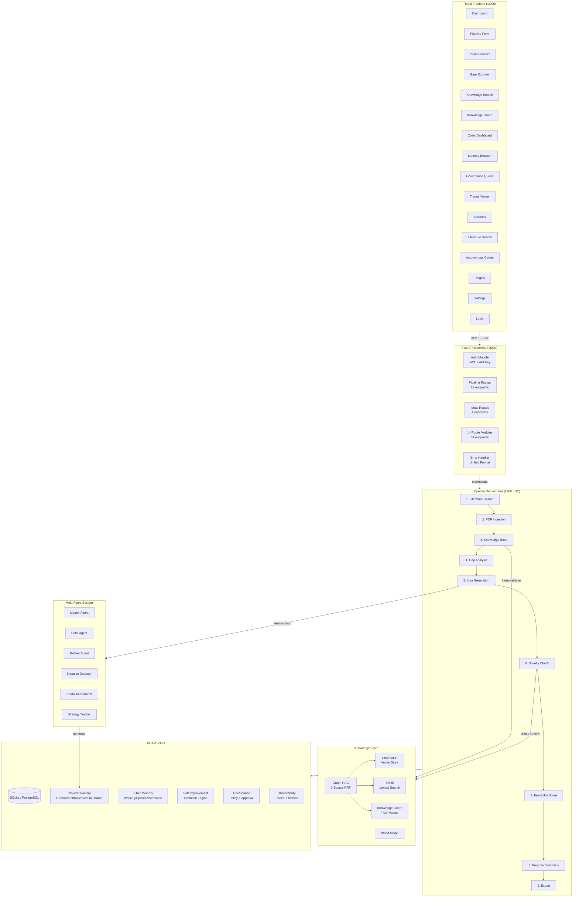

# Elephant Rock — Executive Architecture Brief

**Date:** 2026-05-02 | **Version:** v0.1.0 | **LOC:** 44,073 | **Tests:** 1,714 | **Commits:** 142

---

## What Is Elephant Rock?

Elephant Rock is an **AI-powered research idea generation platform** that takes a research domain (e.g., "AI/NLP") and automatically produces scored, novel research proposals through a 9-stage pipeline. It combines multi-agent debate (Ideator/Critic/Refiner), knowledge graph reasoning with epistemic truth values, and autonomous self-improvement into a system that can continuously generate and refine research ideas without human intervention.

---

## System Architecture



---

## Key Technical Innovations

### 1. Multi-Agent Ideation Loop with Borda Tournament
Three agents (Ideator, Critic, Refiner) debate in rounds. Convergence is detected via **Borda tournament** — an ICLR 2026 pattern where blind judges rank competing proposals, and the incumbent competes as an equal option to prevent scope creep.

### 2. OpenNARS Truth Calculus
The knowledge graph doesn't store binary facts. Every assertion carries a **TruthValue** with frequency (support proportion) and confidence (evidence sufficiency). New evidence revises truth via weighted averaging — beliefs evolve principledly.

### 3. Consciousness State Machine
Autonomous mode uses a PUMA-inspired **5-state machine** (IDLE → EXPLORING → FOCUSED → CONTEMPLATING → DREAMING) with curiosity-driven exploration and boredom-triggered domain discovery.

### 4. Impasse-Driven Learning (Soar Pattern)
When the agent loop gets stuck (duplicate ideas, identical critiques, score plateaus, low diversity), the system detects the impasse type and injects targeted resolutions — constraints, perspective shifts, temperature increases, or strategy switches.

### 5. Three-Source Graph RAG
Retrieval combines BM25 (lexical) + semantic embeddings + knowledge graph walks, fused via weighted Reciprocal Rank Fusion. The graph path traces entity relationships up to 2 hops to find relevant papers.

### 6. Self-Improvement Engine
An evolutionary optimization system that tracks per-stage outcomes with time-decayed weighting, generates LLM-based prompt overlays for underperforming stages, and uses a quality ratchet to never degrade below historical best.

---

## Scale

| Metric | Count |
|:---|:---|
| Backend source lines | 36,277 |
| Frontend source lines | 7,796 |
| API endpoints | 67 |
| Frontend pages | 16 |
| Pipeline subsystems | 32 |
| LLM providers | 5 (+ LiteLLM gateway) |
| Configuration parameters | 227 |
| Database models | 8 |
| Test files | 229 |
| Passing tests | 1,714 |
| AIV governance documents | 158 |
| Git commits | 142 |
| Theoretical foundations | 10+ research traditions |

---

## Platform Capabilities Map

```
┌──────────────────────────────────────────────────────────────────┐
│                     CAPABILITY MATRIX                            │
├──────────────────┬───────────────────────────────────────────────┤
│ INPUT            │ Domain string, PDF uploads, search queries    │
│ PROCESSING       │ 9-stage pipeline, multi-agent debate          │
│ KNOWLEDGE        │ ChromaDB + BM25 + Knowledge Graph + World Model│
│ REASONING        │ Tree-of-Thought, Graph RAG, Negotiation       │
│ EVALUATION       │ GEval, Quality Gates, Adversarial Debate      │
│ MEMORY           │ Working / Episodic / Semantic (3-tier)        │
│ GOVERNANCE       │ Policy Engine + Human Approval + Audit Trail  │
│ SELF-IMPROVE     │ Evolution Engine, A/B Testing, Quality Ratchet│
│ AUTONOMY         │ State Machine, Curiosity Driver, Scheduler    │
│ COLLABORATION    │ Comments, Sharing, Export (PDF/ZIP)           │
│ OBSERVABILITY    │ Traces, Metrics, SSE Streaming, Heartbeats    │
│ SECURITY         │ JWT Auth, RBAC, Encrypted Secrets, Rate Limit │
│ EXTENSIBILITY    │ Plugin System, MCP Integration, Tool Registry │
│ DEPLOYMENT       │ Docker Compose, PostgreSQL, Redis, CI/CD      │
└──────────────────┴───────────────────────────────────────────────┘
```

---

## Reports Generated

| Report | Location |
|:---|:---|
| **Comprehensive Study Report** | `sessions/260501-ivory-wolf/data/comprehensive_study_report_v2.md` |
| **Deep Subsystem Analysis** | `sessions/260501-ivory-wolf/data/deep_subsystem_analysis.md` |
| **Executive Architecture Brief** | `sessions/260501-ivory-wolf/data/executive_architecture_brief.md` |
| **UX Journey Report** | `sessions/260501-ivory-wolf/data/ux_journey_report.md` |
| **Master Roadmap** | `sessions/260501-ivory-wolf/data/master_roadmap_v2.md` |
| **Final Execution Report** | `sessions/260501-ivory-wolf/data/final_execution_report.md` |

---

*Analysis complete. 36,000+ backend LOC, 7,800+ frontend LOC, 229 test files examined across 32 pipeline subsystems.*
