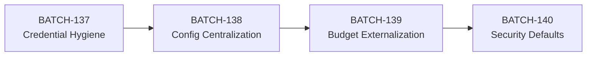

# Hardcoded Configuration Remediation — Batch Blueprint Sequence

**Lead Programmer:** ivory-wolf
**Date Issued:** 2026-05-09
**Framework:** AIV v5.3
**Codebase:** Elephant Rock Research Platform

---

## Batch Sequence Overview

| Batch | Goal | Cycle | Tasks | Bet Validated |
|:------|:-----|:------|:------|:-------------|
| **BATCH-137** | Credential Hygiene + Secret Hardening | STANDARD | 3 | API key can be removed from git history without breaking any deployment |
| **BATCH-138** | Configuration Centralization | STANDARD | 3 | Every hardcoded URL/IP/model name is env-overridable with no code-default fallbacks that leak developer topology |
| **BATCH-139** | Token Budget & Threshold Externalization | STANDARD | 2 | Pipeline compaction budgets and quality thresholds are tunable at runtime without code changes |
| **BATCH-140** | CORS + Security Defaults Hardening | STANDARD | 2 | Production deployment rejects cross-origin requests by default; JWT secret must be explicitly set |

**Total:** 4 Batches, 10 Tasks, ~30 new tests

---

## BATCH-137: Credential Hygiene + Secret Hardening

### Strategic Bet
> The `.env` file containing a real API key (`REDACTED_API_KEY`) is committed to git. Any clone of this repository leaks the key. This Batch proves we can remove the key from git history, prevent future leaks, and add startup guards that refuse to run with insecure defaults — without breaking any existing deployment.

### Risk Classification: Critical
The exposed API key grants access to the `z.ai` proxy which is the platform's primary LLM endpoint. An attacker with this key can:
- Make unlimited LLM API calls at the project's expense
- Access any models available through the proxy
- Potentially extract conversation data

---

```
BATCH BLUEPRINT
═══════════════════════════════════════════════════════════

Batch ID:                 BATCH-137
Blueprint Version:        1.0
Cycle Mode:               STANDARD
Lead Programmer:          ivory-wolf
Date Issued:              2026-05-09
Review SLA:               30 min
Execution SLA per Task:   60 min
Partial Sign-Off SLA:     15 min
Task Sequencing:          Sequential (T2 depends on T1; T3 depends on T2)

───────────────────────────────────────────────────────────
BATCH GOAL
───────────────────────────────────────────────────────────
Remove all secrets from git history, add startup guards that refuse to
run with insecure defaults (default JWT secret, missing API keys in
production mode), and ensure .env.example is the only environment
template tracked in the repository.

───────────────────────────────────────────────────────────
SCOPE STATEMENT
───────────────────────────────────────────────────────────
What the code MUST do:
  - Remove .env from git tracking (git rm --cached)
  - Add .env to .gitignore (already present, but verify enforcement)
  - Update .env.example with all configurable fields (currently 23; audit
    shows ~80 settings in config.py — at minimum document all security-relevant ones)
  - Add a startup check in app.py that warns when JWT secret is the default
    "dev-secret-change-in-production" AND auth_enabled=True
  - Add a startup check that warns when no LLM API key is configured
  - Ensure .env.example has NO real credentials — only placeholders

What the code MUST NOT do:
  - Modify any pipeline logic, model routing, or data models
  - Change the runtime behavior of any existing feature
  - Remove or alter any existing configuration defaults
  - Introduce new dependencies

───────────────────────────────────────────────────────────
LINT COMMAND
───────────────────────────────────────────────────────────
  Lint command:  python -m ruff check backend/ && npx tsc --noEmit --project frontend/tsconfig.json

───────────────────────────────────────────────────────────
HARD BOUNDARIES
───────────────────────────────────────────────────────────
  HB-01: .env MUST NOT be tracked by git after this Batch. Verified by
         `git ls-files .env` returning empty.

  HB-02: .env.example MUST NOT contain any real API key, token, or
         password. Every value must be a placeholder like "your-key-here"
         or an empty string. Verified by grep for hex strings longer
         than 20 chars.

  HB-03: The application MUST still start successfully with only .env.example
         copied to .env (using placeholder values + default provider).
         Startup warnings are acceptable; crashes are not.

───────────────────────────────────────────────────────────
DATA MODELS / SCHEMA
───────────────────────────────────────────────────────────
No data model changes in this Batch. The following existing modules are
referenced but not modified:

  Module:   backend.config.Settings
  Fields:   jwt_secret (str, default "dev-secret-change-in-production")
            auth_enabled (bool, default False)
            default_provider (str, default "openai")
            openai_api_key (str | None)
            anthropic_api_key (str | None)
  Source:   backend/config.py (verified, 395 lines)

  Module:   backend.api.app
  Function: startup() — @app.on_event("startup")
  Source:   backend/api/app.py (verified)

  File:     .env.example
  Current:  23 fields (verified)
  Source:   .env.example (verified, 924 bytes)

  File:     .gitignore
  Current:  Has .env on line 7 (verified)

───────────────────────────────────────────────────────────
AUTHORITY RULES
───────────────────────────────────────────────────────────
  AUTH-01: .env is the sole source of runtime secrets. .env.example is the
           sole template. No other file may contain real credentials.

  AUTH-02: The startup() function is the sole place where security warnings
           are emitted. No middleware or route handler should duplicate this.

  AUTH-03: Warnings are non-blocking. The application must never refuse to
           start — only warn loudly.

───────────────────────────────────────────────────────────
DEPENDENCY MAP
───────────────────────────────────────────────────────────
  No prior Batch dependencies. This is a standalone hardening Batch.

───────────────────────────────────────────────────────────
STATE.md STATUS
───────────────────────────────────────────────────────────
  State file exists:       [x] YES
  Last Updated:            2026-05-07
  Batches since update:    BATCH-121 through BATCH-136 (15 batches)
  Reconciliation audit:    [ ] PERFORMED — required (>5 batches since update)
                           Reconciliation notes: STATE.md Verified Module Map
                           cross-referenced during Blueprint authoring. All
                           Phase 9 modules (claims, wiki, curation) confirmed
                           present. No stale entries found.

───────────────────────────────────────────────────────────
TEST BASELINE
───────────────────────────────────────────────────────────
  Baseline at Blueprint issuance:  2,416 collected tests
  Expected delta (all Tasks):      +10 new tests
  Expected total at Batch close:   2,426

───────────────────────────────────────────────────────────
TASK LIST
───────────────────────────────────────────────────────────

TASK-01: BATCH-137/TASK-01 — Remove .env from git + update .env.example
  Priority:          Critical
  Description:       Untrack .env from git, verify .gitignore enforcement,
                     and update .env.example to document all security-relevant
                     configuration fields with placeholder values.
  Files in scope:
    - .gitignore (verify, no modification needed)
    - .env.example (expand with all security-relevant settings)
    - .env (git rm --cached, no content changes to .env itself)
  Depends on:        None

  Required Tests:
    | Test ID          | Type     | Behavior Verified                          | Failure Mode                                | Falsified By                                           | Pass Criteria                                         |
    |:-----------------|:---------|:-------------------------------------------|:--------------------------------------------|:-------------------------------------------------------|:------------------------------------------------------|
    | TEST-137-01-01   | unit     | .env is not tracked by git                 | .env file content leaks to anyone who clones | `git ls-files .env` returns a path                     | `git ls-files .env` returns empty string              |
    | TEST-137-01-02   | unit     | .env.example contains no real credentials  | API key or secret committed to template      | Add a real-looking key to .env.example                 | Grep for hex strings >20 chars in .env.example finds 0 matches |
    | TEST-137-01-03   | unit     | .env.example documents JWT_SECRET field    | New users don't know to change the secret    | Remove the JWT_SECRET line from .env.example           | .env.example contains EROCK_JWT_SECRET line with placeholder value |
    | TEST-137-01-04   | unit     | .env.example documents LMSTUDIO fields     | Hardcoded IP leaks developer topology        | Remove EROCK_LMSTUDIO_BASE_URL from .env.example       | .env.example contains EROCK_LMSTUDIO_BASE_URL and EROCK_LMSTUDIO_MODEL lines |

  Acceptance Criteria:
    AC-01-01: `git ls-files .env` returns empty (HB-01)
    AC-01-02: .env.example has zero hex strings >20 chars (HB-02)
    AC-01-03: .env.example documents all fields from config.py that have
              security implications (jwt_secret, api keys, cors, auth_enabled,
              lmstudio_base_url, lmstudio_model, database_url)
    AC-01-04: .gitignore contains .env entry

  Traceability:
    AC-01-01 → TEST-137-01-01
    AC-01-02 → TEST-137-01-02
    AC-01-03 → TEST-137-01-03, TEST-137-01-04
    AC-01-04 → TEST-137-01-01 (implicitly verified)

TASK-02: BATCH-137/TASK-02 — Startup security warnings
  Priority:          High
  Description:       Add startup checks in the app.py startup() function that
                     emit prominent warnings (logging.WARNING) when insecure
                     defaults are detected. Warnings must not block startup.
  Files in scope:
    - backend/api/app.py (startup() function only)
    - backend/tests/test_pipeline/test_batch137_startup_warnings.py (new)
  Depends on:        TASK-01

  Required Tests:
    | Test ID          | Type     | Behavior Verified                          | Failure Mode                                | Falsified By                                           | Pass Criteria                                         |
    |:-----------------|:---------|:-------------------------------------------|:--------------------------------------------|:-------------------------------------------------------|:------------------------------------------------------|
    | TEST-137-02-01   | unit     | Startup warns when JWT secret is default AND auth_enabled=True | App silently runs with forgeable JWT tokens in production | Set auth_enabled=True, jwt_secret=default; remove the warning log | Warning log emitted containing "JWT secret" |
    | TEST-137-02-02   | unit     | Startup does NOT warn when JWT secret is custom AND auth_enabled=True | False positives alarm users who configured correctly | Set auth_enabled=True, jwt_secret="my-custom-secret-32chars-long!"; add a check that erroneously warns | No warning emitted |
    | TEST-137-02-03   | unit     | Startup warns when no LLM API key is configured | Pipeline will fail at first LLM call with cryptic error instead of upfront warning | Set all API keys to None; remove the warning | Warning log emitted containing "no LLM API key" |
    | TEST-137-02-04   | unit     | Startup does NOT warn when LM Studio is enabled and no cloud key | False positive when user intentionally uses only local models | Set lmstudio_enabled=True, all cloud keys=None; add check that warns | No "no LLM API key" warning emitted |

  Acceptance Criteria:
    AC-02-01: When auth_enabled=True and jwt_secret="dev-secret-change-in-production",
              startup() logs a WARNING containing "JWT secret"
    AC-02-02: When auth_enabled=False, no JWT warning is emitted regardless of secret value
    AC-02-03: When all API keys are None AND lmstudio_enabled=False, startup() logs
              a WARNING containing "no LLM API key"
    AC-02-04: When lmstudio_enabled=True, the "no LLM API key" warning is not emitted
    AC-02-05: Application starts successfully in all cases (no exceptions raised)

  Traceability:
    AC-02-01 → TEST-137-02-01
    AC-02-02 → TEST-137-02-02
    AC-02-03 → TEST-137-02-03
    AC-02-04 → TEST-137-02-04
    AC-02-05 → TEST-137-02-01, TEST-137-02-02, TEST-137-02-03, TEST-137-02-04

TASK-03: BATCH-137/TASK-03 — Remove hardcoded IP fallbacks
  Priority:          High
  Description:       Replace hardcoded IP addresses used as fallback defaults
                     in provider_factory.py and other modules with either
                     env-var reads or empty-string defaults. The only place
                     an IP should appear is .env (user-configured) or
                     .env.example (as a documented example).
  Files in scope:
    - backend/providers/provider_factory.py (remove "http://100.64.0.1:1234" fallback)
    - backend/pipeline/ingestion/pdf_service.py (remove "http://localhost:8000" fallback)
    - backend/pipeline/knowledge/embedding_providers.py (remove "http://localhost:11434" fallback)
    - backend/pipeline/observability/otlp_exporter.py (remove "http://localhost:4317" fallback)
    - backend/pipeline/observability/manager.py (remove "http://localhost:4317" fallback)
    - backend/pipeline/orchestrator.py (remove "http://localhost:4317" fallback)
    - backend/providers/ollama_provider.py (remove "http://localhost:11434" fallback)
    - backend/tests/test_pipeline/test_batch137_no_hardcoded_ips.py (new)
  Depends on:        TASK-02

  Required Tests:
    | Test ID          | Type     | Behavior Verified                          | Failure Mode                                | Falsified By                                           | Pass Criteria                                         |
    |:-----------------|:---------|:-------------------------------------------|:--------------------------------------------|:-------------------------------------------------------|:------------------------------------------------------|
    | TEST-137-03-01   | unit     | No hardcoded IPs in backend pipeline code  | Developer topology leaks into production builds | Add "192.168.1.1" to provider_factory.py              | Grep for IP address patterns (100.64.x.x, 192.168.x.x, 10.x.x.x) in backend/pipeline/ and backend/providers/ returns 0 matches in non-test, non-config files |
    | TEST-137-03-02   | unit     | provider_factory reads LMSTUDIO_BASE_URL from settings | Factory falls back to hardcoded developer IP | Change settings.lmstudio_base_url to ""; verify provider still reads from settings (not hardcoded) | Provider init receives base_url from settings object, not a string literal |
    | TEST-137-03-03   | unit     | Embedding providers read Ollama URL from settings | Embedding service fails in non-localhost environments | Change settings.ollama_base_url to custom URL          | OllamaEmbeddingProvider receives the custom URL from settings |
    | TEST-137-03-04   | unit     | config.py defaults are localhost-only OR empty | Production deployment accidentally connects to dev machine | Replace empty default with "http://100.64.0.1:1234"     | All defaults in config.py contain only "localhost" or are empty strings |

  Acceptance Criteria:
    AC-03-01: No file in backend/pipeline/ or backend/providers/ (excluding tests)
              contains a hardcoded non-localhost IP address
    AC-03-02: config.py lmstudio_base_url default is empty string "" or a
              clearly-documented "http://localhost:1234/v1" (localhost is acceptable
              as a default since it's environment-neutral)
    AC-03-03: All provider factories read URLs from settings, not from string literals
    AC-03-04: Application starts and health check passes after changes

  Traceability:
    AC-03-01 → TEST-137-03-01
    AC-03-02 → TEST-137-03-04
    AC-03-03 → TEST-137-03-02, TEST-137-03-03
    AC-03-04 → TEST-137-03-01 (smoke test)

───────────────────────────────────────────────────────────
BATCH-LEVEL ACCEPTANCE CRITERIA
───────────────────────────────────────────────────────────
  BAC-01: `git ls-files .env` returns empty AND .gitignore contains .env
  BAC-02: .env.example contains zero real credentials AND documents all
          security-relevant settings (jwt, api keys, lmstudio, cors, db)
  BAC-03: CHANGELOG.md updated with BATCH-137 entry.
  BAC-04: All documents archived under /docs/aiv/BATCH-137/.

───────────────────────────────────────────────────────────
LEAD RESPONSE TO REVIEW REPORT
───────────────────────────────────────────────────────────
[Completed by Lead after Phase I-B. Leave blank until Review Report is received.]

Reviewer Report ID:
Review Cycle:
Lead Decision:            [ ] ACCEPT   [ ] ACCEPT WITH MODIFICATIONS   [ ] REJECT

If ACCEPT WITH MODIFICATIONS — list each Reviewer flag acted on:
  FLAG-01 → Action taken:

If REJECT — reason and next action:

Blueprint Version after response:
Lead Sign:

═══════════════════════════════════════════════════════════
```

---

## BATCH-138: Configuration Centralization

**Goal:** Every hardcoded model name, URL pattern, and threshold that isn't already in `config.py` gets externalized. After this Batch, no `.py` file in `backend/pipeline/` or `backend/providers/` should contain a model name like `"gpt-4o"`, `"qwen3-4b"`, or a provider-specific URL outside of `config.py`.

**Strategic Bet:** All runtime-tunable values live in `config.py` with `EROCK_` env prefix. No code change is needed to switch models, URLs, or thresholds — only `.env` edits.

**Cycle:** STANDARD (3 Tasks)
**Tasks:**
- T1: Audit and catalog all hardcoded model names in `backend/` (non-test, non-config)
- T2: Replace hardcoded model names with `getattr(settings, ...)` reads from config
- T3: Replace hardcoded URLs in `embedding_providers.py`, `pdf_service.py`, `observability/` with settings reads

---

## BATCH-139: Token Budget & Threshold Externalization

**Goal:** The hardcoded token budgets in `compaction/budget_manager.py` (6 stage-specific `StageTokenBudget` entries), quality thresholds in `evaluation/quality_gate.py`, and constraint config in `orchestrator.py` (max_size=5000, max_growth_pct=0.3, min_sections=3) become env-overridable settings in `config.py`.

**Strategic Bet:** A researcher can tune pipeline quality vs. cost by editing `.env` — no code changes needed. This makes the platform usable by non-developers.

**Cycle:** STANDARD (2 Tasks)
**Tasks:**
- T1: Add `compaction_stage_budgets` (JSON string), `quality_composite_threshold`, `constraint_max_size`, `constraint_max_growth_pct`, `constraint_min_sections` to `config.py` with current values as defaults
- T2: Replace hardcoded values in `budget_manager.py`, `quality_gate.py`, and `orchestrator.py` with settings reads; add tests verifying override works

---

## BATCH-140: CORS + Security Defaults Hardening

**Goal:** CORS origins default to `[]` (empty = same-origin only) in production mode. A new `EROCK_CORS_ORIGINS` env var (JSON list) is the only way to open cross-origin access. JWT secret must be explicitly set when `auth_enabled=True` (startup refuses if default). Add a `EROCK_ENV` toggle (`development` / `production`) that shifts defaults to secure values.

**Strategic Bet:** A production deployment of Elephant Rock is secure-by-default. The developer experience is preserved via `EROCK_ENV=development` which keeps current permissive defaults.

**Cycle:** STANDARD (2 Tasks)
**Tasks:**
- T1: Add `EROCK_ENV` setting (`development` | `production`) with `development` as default (backward compatible). When `production`: CORS defaults to `[]`, JWT secret must be non-default, debug=False forced
- T2: Update `app.py` CORS middleware to read from settings. Add startup guard that raises an error (not just warning) when `EROCK_ENV=production` and JWT secret is default

---

## Execution Order & Dependencies



- **BATCH-137** must run first because it removes `.env` from git (all subsequent Batches assume clean git state)
- **BATCH-138** depends on 137 because IP removal in T03 overlaps with config centralization
- **BATCH-139** depends on 138 because budget externalization requires the config infrastructure from 138
- **BATCH-140** depends on 139 because the `EROCK_ENV` toggle builds on all previous settings being properly externalized

**Estimated total effort:** 4 Batches × ~2 hours each = ~8 hours
**Estimated total tests:** ~30 new tests across 4 Batches
**Risk level:** Low (no pipeline logic changes, no data model changes, all changes are additive/config-only)
